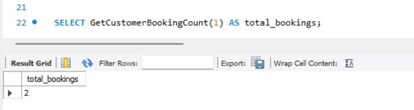
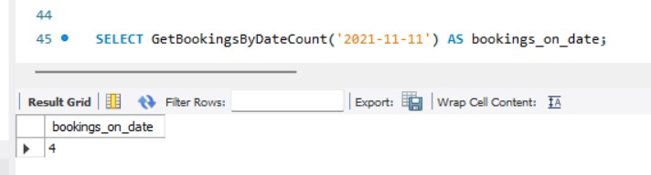
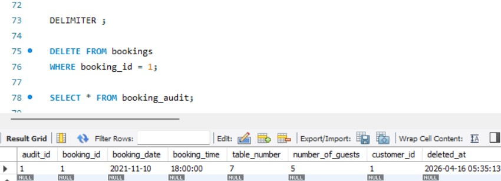
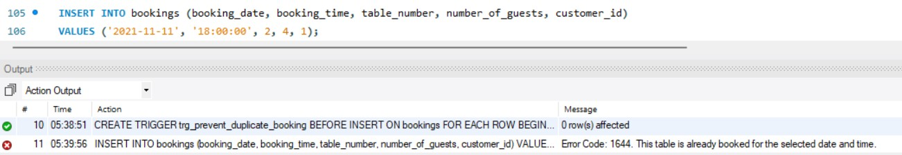

# Business Problems Solved

This document explains the main business questions answered by the SQL scripts in this project and shows the related output previews.

## 1. Which bookings fall within a date range?

The first task checks which reservations were made between two dates. This is useful for reporting daily activity or reviewing bookings for a short period.

**SQL file:** `sql/03_core_queries.sql`

**Preview:**

## 2. Which customers booked on a specific day?

This task joins the `customers` and `bookings` tables to show which customer made each reservation. It helps staff quickly identify who booked on a given day.

**SQL file:** `sql/03_core_queries.sql`

**Preview:**

## 3. How many bookings were made each day?

This query groups bookings by date and counts them. It is useful for understanding which days are busiest.

**SQL file:** `sql/03_core_queries.sql`

**Preview:**

## 4. How do we update the price of a menu item?

This task updates the cost of the `Chicken Kottu` menu item and then checks the new value. It shows how menu prices can be maintained.

**SQL file:** `sql/04_structure_and_updates.sql`

**Preview:**

## 5. How do we store customer delivery addresses?

This task inserts delivery address records and shows the table structure. It helps the restaurant keep track of where customers want orders delivered.

**SQL file:** `sql/04_structure_and_updates.sql`

**Previews:**

## 6. How do we add a new column to track availability?

This task changes the `menu_items` table by adding an `is_available` column. It shows how the schema can be updated when new business needs appear.

**SQL file:** `sql/04_structure_and_updates.sql`

**Preview:**

## 7. Which customers made bookings on a specific date?

This task uses a subquery to find customers who booked on a chosen day. It is useful for targeted customer lookups.

**SQL file:** `sql/05_subqueries_and_views.sql`

**Preview:**

## 8. How can we simplify booking lookups with a view?

This task creates a view that shows bookings before a given date and with more than three guests. Views make frequently used queries easier to reuse.

**SQL file:** `sql/05_subqueries_and_views.sql`

**Preview:**

## 9. How can we retrieve bookings for a chosen date?

This task creates a stored procedure that returns bookings for a specific date. It makes date-based booking lookups reusable and organized.

**SQL file:** `sql/06_procedures_and_strings.sql`

**Preview:**

## 10. How can booking details be displayed in one formatted column?

This task uses `CONCAT` to combine booking data into a readable text format. It is useful for reports and simple summary output.

**SQL file:** `sql/06_procedures_and_strings.sql`

**Preview:**

## 11. How many bookings does a customer have?

This task creates and calls a function that returns total bookings for a selected customer ID. It supports quick customer-level booking analysis.

**SQL file:** `sql/07_functions_and_triggers.sql`

**Preview:**

## 12. How many bookings were made on a specific date?

This task creates and calls a function that returns booking count for a selected date. It helps with daily booking trend checks.

**SQL file:** `sql/07_functions_and_triggers.sql`

**Preview:**

## 13. How can deleted bookings be tracked for audit purposes?

This task uses an `AFTER DELETE` trigger to write removed booking rows into the `booking_audit` table. It preserves a record of deleted bookings for review.

**SQL file:** `sql/07_functions_and_triggers.sql`

**Preview:**

## 14. How can duplicate bookings be prevented automatically?

This task uses a `BEFORE INSERT` trigger to block duplicate bookings for the same date, time, and table number. It enforces booking consistency at the database level.

**SQL file:** `sql/07_functions_and_triggers.sql`

**Preview:**

## Summary

These SQL tasks cover the main business needs of the restaurant project:

- Booking lookup and reporting
- Customer and reservation matching
- Menu updates and schema changes
- Delivery address tracking
- Reusable queries with views and procedures
- User-defined functions for reusable counts
- Triggers for data audit and business rule enforcement
- Formatted output for reporting
