# Little Lemon MySQL Portfolio Project 🍋

A comprehensive MySQL database project showcasing restaurant management system design and implementation. This project demonstrates advanced SQL capabilities including schema design, data manipulation, complex queries, stored procedures, and database optimization techniques.

## 📋 Project Overview

The Little Lemon database simulates a complete restaurant booking and menu management system, featuring normalized relational tables, integrity constraints, and business logic implementation through stored procedures and views.

**Background**: This project was developed after completing the **"Database Structures and Management with MySQL"** certification by **Meta**, applying the concepts and best practices learned throughout the course.

## 🛠️ Technology Stack

- **Database**: MySQL 8.0 (tested on MySQL 8.0.x)
- **Development Tool**: MySQL Workbench
- **Version Control**: Git

## 📊 Database Architecture

**Database Name**: `little_lemon_portfolio`

### Schema Design

| Table | Description |
|-------|-------------|
| `customers` | Customer information and contact details |
| `dining_tables` | Restaurant seating capacity and table management |
| `bookings` | Reservation records with customer and table references |
| `menu_items` | Menu offerings with pricing and ingredient details |
| `delivery_addresses` | Customer delivery locations |

**Key Features**:
- Primary and Foreign Key constraints ensuring referential integrity
- Normalized structure (3NF) to minimize data redundancy
- Indexed fields for optimized query performance

### Entity Relationship Diagram

The following ER diagram illustrates the database structure and relationships between tables:


The diagram showcases:
- **One-to-Many relationships** between customers and bookings/delivery addresses
- **Foreign key constraints** maintaining referential integrity
- **Normalized table structure** for efficient data management

## 🚀 Installation & Setup

### Option 1: Run in Docker (Recommended - 100% Reproducible)

**Prerequisites**: Docker and Docker Compose installed

1. **Clone the repository**
   ```bash
   git clone https://github.com/visurarodrigo/little-lemon-mysql-portfolio-project.git
   cd little-lemon-mysql-portfolio-project
   ```

2. **Start the MySQL container**
   ```bash
   docker-compose up -d
   ```
   This will:
   - Pull MySQL 8.0 image
   - Create database `little_lemon_portfolio`
   - Automatically run all SQL scripts in order
   - Expose MySQL on `localhost:3306`

3. **Connect to the database**
   ```bash
   docker exec -it little-lemon-mysql mysql -u lemon_user -plemon_pass little_lemon_portfolio
   ```

   Or use MySQL Workbench/any MySQL client with:
   - **Host**: `localhost`
   - **Port**: `3306`
   - **Username**: `lemon_user`
   - **Password**: `lemon_pass`
   - **Database**: `little_lemon_portfolio`

4. **Stop the container when done**
   ```bash
   docker-compose down
   ```

   To remove all data and start fresh:
   ```bash
   docker-compose down -v
   ```

### Option 2: Local MySQL Installation

**Prerequisites**: MySQL Server 8.x or higher, MySQL Workbench (recommended) or MySQL CLI

1. **Clone the repository**
   ```bash
   git clone https://github.com/visurarodrigo/little-lemon-mysql-portfolio-project.git
   cd little-lemon-mysql-portfolio-project
   ```

2. **Execute SQL scripts in order**
   ```sql
   source sql/00_setup.sql;       -- Create database
   source sql/01_schema.sql;      -- Create tables and constraints
   source sql/02_seed.sql;        -- Insert sample data
   source sql/03_core_queries.sql; -- Basic queries
   ```

   *Optional advanced scripts (if available)*:
   - `sql/04_structure_and_updates.sql`
   - `sql/05_subqueries_and_views.sql`
   - `sql/06_procedures_and_strings.sql`

## 💡 Features Demonstrated

### Core SQL Competencies
✅ **Data Filtering**: WHERE clauses with BETWEEN operators  
✅ **Table Joins**: INNER JOIN for multi-table queries  
✅ **Aggregation**: GROUP BY with COUNT functions  
✅ **Data Integrity**: Primary Keys, Foreign Keys, and UNIQUE constraints  
✅ **Schema Modification**: ALTER TABLE operations  

### Advanced Techniques
✅ **Subqueries**: Nested SELECT statements for complex filtering  
✅ **Views**: Virtual tables for simplified data access  
✅ **Stored Procedures**: Parameterized routines for reusable logic  
✅ **String Functions**: CONCAT for formatted output  

### 🗂️ Views & Procedures

**Views:**
- `bookings_view` - Filtered booking records for dates before 2021-11-13 with more than 3 guests

**Stored Procedures:**
- `GetBookingsData(InputDate)` - Retrieve all bookings for a specific date, ordered by time

## � Business Questions Solved

This project demonstrates practical SQL solutions to real-world restaurant management challenges:

1. **"Which bookings fall within a specific date range?"**  
   → Date range filtering with BETWEEN operator | [sql/03_core_queries.sql](sql/03_core_queries.sql)

2. **"Which customers have reservations on a particular date?"**  
   → JOIN operation linking customers and bookings | [sql/03_core_queries.sql](sql/03_core_queries.sql)

3. **"Which dates have the most bookings?"**  
   → Aggregation with GROUP BY and COUNT | [sql/03_core_queries.sql](sql/03_core_queries.sql)

4. **"How do I update menu item pricing?"**  
   → UPDATE statement for data modifications | [sql/04_structure_and_updates.sql](sql/04_structure_and_updates.sql)

5. **"How can I add new delivery addresses for customers?"**  
   → INSERT operations with foreign key relationships | [sql/04_structure_and_updates.sql](sql/04_structure_and_updates.sql)

6. **"How do I add new columns to track menu item availability?"**  
   → ALTER TABLE for schema modifications | [sql/04_structure_and_updates.sql](sql/04_structure_and_updates.sql)

7. **"Which customers made bookings on a specific date?"**  
   → Subquery filtering customer records | [sql/05_subqueries_and_views.sql](sql/05_subqueries_and_views.sql)

8. **"How can I retrieve bookings by date using a stored procedure?"**  
   → `GetBookingsData(InputDate)` parameterized procedure | [sql/06_procedures_and_strings.sql](sql/06_procedures_and_strings.sql)

## �📸 Query Results & Output Previews

### Task 1: Date Range Filtering (BETWEEN)
Retrieve bookings within a specific date range using BETWEEN operator.

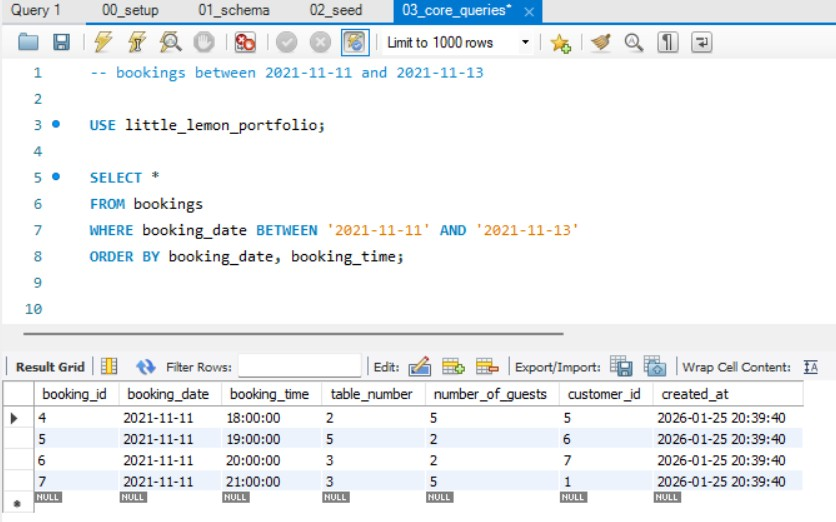

---

### Task 2: Customer Bookings (JOIN)
Join customers and bookings tables to show customer names with their reservation IDs.

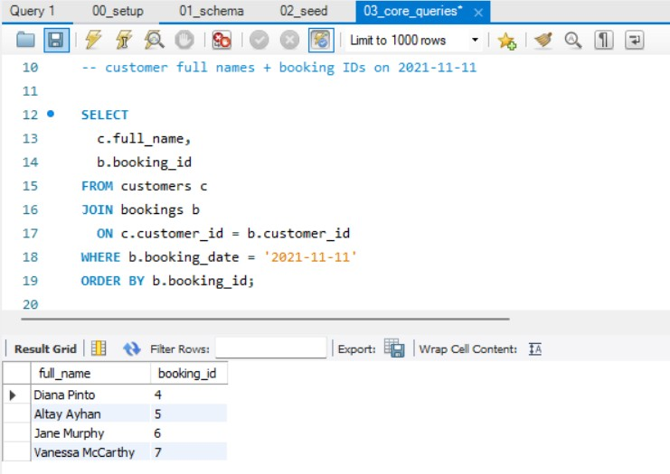

---

### Task 3: Booking Statistics (GROUP BY)
Aggregate bookings by date to analyze reservation patterns.

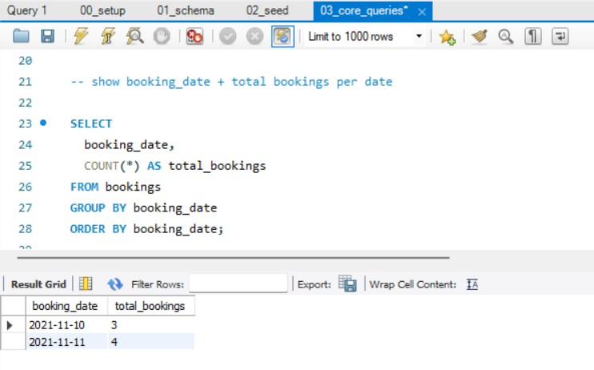

---

### Task 4: Data Updates
Update specific records in the database (Kabasa example).

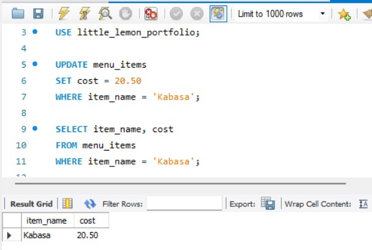

---

### Task 5: Delivery Address Management
Query and display customer delivery addresses with column structure.

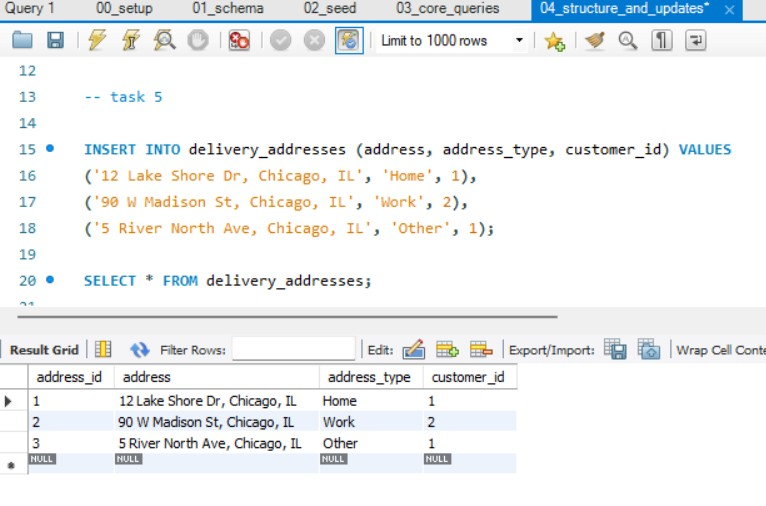
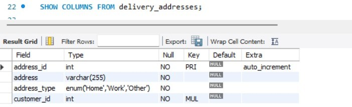

---

### Task 6: Schema Modifications (ALTER TABLE)
Add or modify columns in the menu_items table.

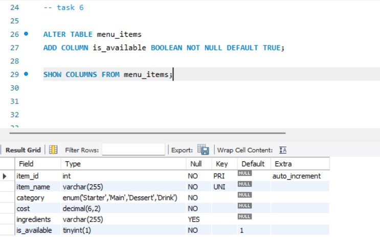

---

### Task 7: Subquery Filtering
Use subqueries to filter customers based on specific criteria.

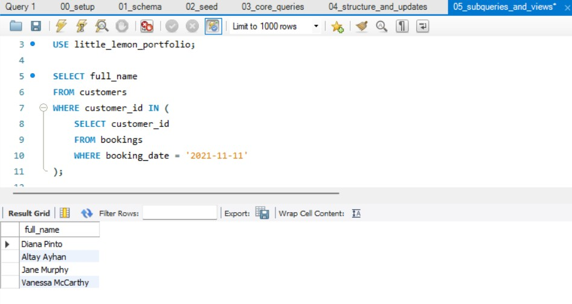

---

### Task 8: Bookings View Creation
Create a view for simplified booking queries.

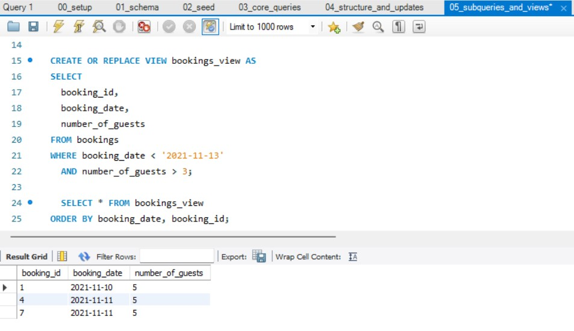

---

### Task 9: Stored Procedure Execution
Call stored procedures with parameters for dynamic queries.

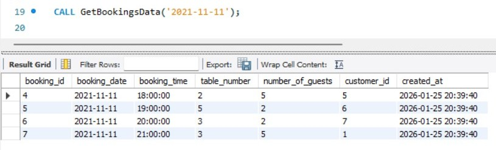

---

### Task 10: Comprehensive Booking Details
Display formatted booking information with string concatenation.

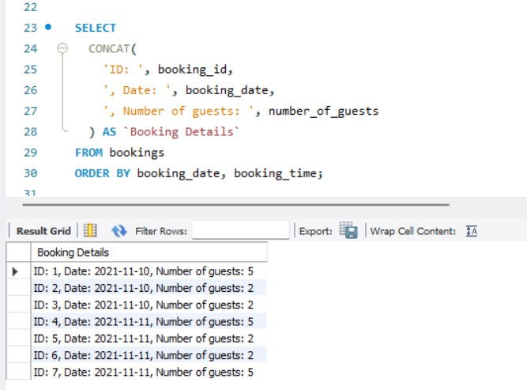

---

## 📁 Project Structure

```
little-lemon-mysql-portfolio-project/
├── README.md
├── sql/
│   ├── 00_setup.sql              # Database creation
│   ├── 01_schema.sql             # Table definitions
│   ├── 02_seed.sql               # Sample data
│   └── 03_core_queries.sql       # Query examples
└── outputs/                       # Query result screenshots
    ├── task1_between.jpg
    ├── task2_join.png.jpg
    ├── task3_groupby.jpg
    └── ...
```

## 🎯 Learning Outcomes

This project demonstrates proficiency in:
- Relational database design and normalization
- SQL query optimization and best practices
- Data integrity management through constraints
- Complex query construction with multiple tables
- Stored procedure development for business logic
- View creation for data abstraction

## 📝 License

This project is licensed under the MIT License - see the [LICENSE](LICENSE) file for details.

## 👤 Author

**Visurarodrigo**
- GitHub: [@visurarodrigo](https://github.com/visurarodrigo)

---

*This project was created as a portfolio demonstration of MySQL database development skills.*
